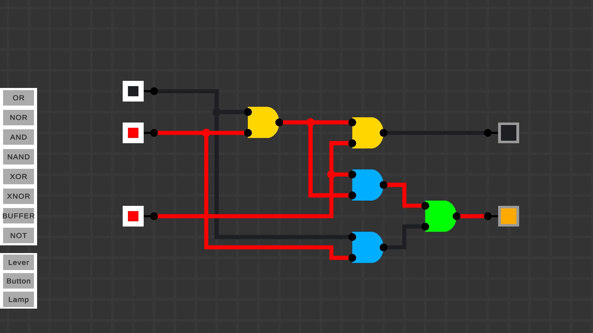

# Logic Lab Program
 Advanced Digital Logic Simulator

Programmet er en digital logik simulator. Jeg har implementeret en logik-engine der bruger et tick-baseret system til at opdatere kredsløbet. Man kan indsætte alle de basale logic gates som forventes af en digital logik simulator (OR, NOR, AND, NAND, XOR, XNOR, BUFFER, NOT) samt nogle komponenter til I/O som en knap og lampe. Mere avancerede komponenter implementeret på højere niveau, som RAM eller Multiplexers osv. Disse kan dog implementeres med de fundamentale komponenter som gives i programmet på nuværende tidspunkt.

Programmet er skrevet i C# ved at bruge Unity Frameworket, og det er stadig i en beta-version, men kan sagtens benyttes. 
Jeg har arbejdet på projektet i omkring 3 måneder, hvor jeg har designet alle systemer fra bundet af. Kodens udvikling kan ses i commit historien på siden her.

*Her vises et screenshot fra programmet, hvor at et diagram for et Binary Adder kredsløb implementeres.*
*På billedet vises simulationen også, da vi kan se at input A øverst er 1, samt Carry-In (Cin) input er 1. Derfor giver kredsløbet en sum på 0, og et Carry-Out (Cout) signal på 1.*

*Designet for denne implementering findes her*

